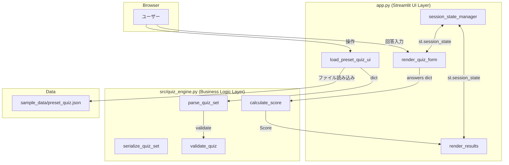
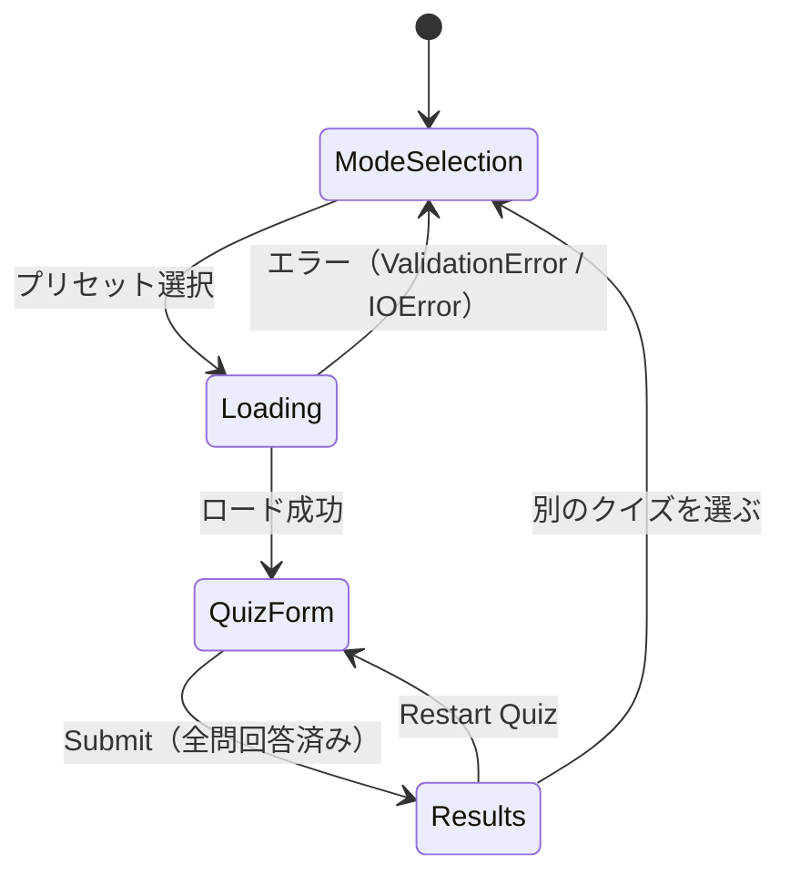

# Design Document: QuickQuiz Studio MVP

## Overview

QuickQuiz Studio は、技術ドキュメントや記事を元に 4 択インタラクティブクイズを生成・提供する Streamlit Web アプリケーションです。

MVP の設計目標は次の 3 点です。

1. **UI とビジネスロジックの完全分離** — `app.py` はレンダリングと状態管理のみを担当し、採点・バリデーション・パースのロジックは `src/quiz_engine.py` に閉じた副作用のない純粋関数として実装します。これにより将来の LLM API 生成モードへの拡張や、UI フレームワーク変更が容易になります。
2. **プリセット即答モード** — `sample_data/preset_quiz.json` をオフラインで即時ロードし、ネットワーク遅延なしにデモ動作を保証します。
3. **堅牢なバリデーション** — 不正なクイズデータは `ValidationError` を通じて明示的に通知し、アプリのクラッシュを防ぎます。

### 将来の拡張ポイント（MVP スコープ外）

- LLM API（OpenRouter / Gemini 等）による動的クイズ生成: `quiz_engine.py` に `generate_quiz_set(text: str) -> QuizSet` を追加するだけで統合可能なアーキテクチャとする。
- URL からの記事取得: `app.py` に URL 入力フォームを追加し、`requests` でテキストを取得して上記の生成関数に渡す形で拡張できる。
- ユーザー認証・スコア永続化ストレージ: MVP では `st.session_state` のみを使用し、DB 連携は含めない。

---

## Architecture

QuickQuiz Studio のコンポーネント構成を以下に示します。



### レイヤー責務

| レイヤー | ファイル | 責務 |
|---|---|---|
| UI Layer | `app.py` | Streamlit ウィジェットの描画、`st.session_state` の管理、フォームの制御、採点演出 |
| Business Logic Layer | `src/quiz_engine.py` | JSON パース、バリデーション、採点計算、シリアライズ（純粋関数のみ） |
| Data | `sample_data/preset_quiz.json` | プリセットクイズデータ（静的ファイル） |

**設計原則**: `src/quiz_engine.py` は `streamlit` を一切インポートしません。`st.session_state` への参照は `app.py` にのみ存在します。

---

## Components and Interfaces

### app.py

#### 主要関数

```python
def main() -> None:
    """Streamlit アプリのエントリーポイント。ページルーティングを制御する。"""

def render_mode_selection() -> None:
    """クイズモード選択画面を描画する（MVP: プリセットのみ）。"""

def load_preset_quiz() -> QuizSet | None:
    """sample_data/preset_quiz.json を読み込み、parse_quiz_set を呼び出す。
    ValidationError または IOError をキャッチし、エラーメッセージを表示して None を返す。"""

def render_quiz_form(quiz_set: QuizSet) -> None:
    """quiz_set の各 Quiz をラジオボタンフォームとして描画する。
    回答を st.session_state に保存する。
    全問回答済みの場合のみ Submit ボタンを有効化する。"""

def render_results(quiz_set: QuizSet, score: Score, answers: dict[int, int]) -> None:
    """採点結果と解説カードを描画する。
    score.percentage >= 80 の場合は st.balloons() を呼び出す。"""

def get_session_key(quiz_id: int) -> str:
    """Quiz id から st.session_state のキーを生成する。
    形式: 'answer_{quiz_id}'"""

def clear_quiz_answers(quiz_set: QuizSet) -> None:
    """QuizSet に含まれる Quiz の回答キーのみを st.session_state から削除する。"""

def all_answered(quiz_set: QuizSet) -> bool:
    """全問に回答が選択されているかを判定する純粋関数（session_state を引数として受ける設計も可）。"""
```

#### 状態遷移



### src/quiz_engine.py

#### 主要関数シグネチャ

```python
class ValidationError(Exception):
    """クイズデータのバリデーション失敗を表す例外。
    message に quiz_id（または位置インデックス）、フィールド名、違反内容を含む。"""
    def __init__(self, quiz_id: int | str, field: str, reason: str) -> None: ...

def parse_quiz_set(data: dict) -> QuizSet:
    """dict から QuizSet オブジェクトを生成する。
    各 Quiz に対して validate_quiz を呼び出す。
    ValidationError は呼び出し元へ伝播させる。"""

def serialize_quiz_set(quiz_set: QuizSet) -> dict:
    """QuizSet オブジェクトを JSON 互換の dict に変換する。
    serialize 前に validate_quiz を呼び出し、不正なオブジェクトは ValidationError を送出する。"""

def validate_quiz(quiz: Quiz) -> None:
    """Quiz オブジェクトのバリデーションを実行する。
    違反があれば ValidationError を送出する。副作用なし。"""

def calculate_score(quizzes: list[Quiz], answers: dict[int, int]) -> Score:
    """quizzes と answers dict から Score を計算する。
    answers に存在しない quiz_id は不正解として扱う。
    quizzes が空の場合は Score(0, 0, 0.0) を返す。副作用なし。"""
```

---

## Data Models

```python
from dataclasses import dataclass, field

@dataclass
class Quiz:
    """単一の問題を表すデータクラス。"""
    id: int
    question: str
    choices: list[str]      # 厳密に 4 個
    correct_index: int      # 0 <= correct_index <= 3
    explanation: str

@dataclass
class QuizSet:
    """クイズ全体（タイトル + 問題リスト）を表すデータクラス。"""
    title: str
    source_topic: str
    questions: list[Quiz]

@dataclass
class Score:
    """採点結果を表すデータクラス。"""
    correct_count: int
    total_questions: int
    percentage: float       # (correct_count / total_questions) * 100, 小数点1桁丸め
                            # total_questions == 0 の場合は 0.0
```

### JSON スキーマ（preset_quiz.json）

```json
{
  "title": "string (non-empty)",
  "source_topic": "string (non-empty)",
  "questions": [
    {
      "id": "integer",
      "question": "string (non-empty)",
      "choices": ["string (non-empty)", "string (non-empty)", "string (non-empty)", "string (non-empty)"],
      "correct_index": "integer (0–3)",
      "explanation": "string (non-empty)"
    }
  ]
}
```

---

## Validation Design

`validate_quiz` はすべての不変条件を一元的に検証します。`parse_quiz_set` と `serialize_quiz_set` の両方から呼び出されます。

### バリデーションルール

| フィールド | ルール | 違反時のエラーメッセージ例 |
|---|---|---|
| `choices` | `len(choices) == 4` かつ各要素が非空文字列 | `Quiz id=2: 'choices' must have exactly 4 non-empty strings, got 3` |
| `correct_index` | `0 <= correct_index <= 3` | `Quiz id=2: 'correct_index' must be in [0, 3], got 5` |
| `id` | 整数型、存在する | `Quiz pos=0: 'id' is missing or not an integer` |
| `question` | 非空文字列 | `Quiz id=2: 'question' must be a non-empty string` |
| `explanation` | 非空文字列 | `Quiz id=2: 'explanation' must be a non-empty string` |

### ValidationError の構造

```python
ValidationError(
    quiz_id=2,          # id が存在しない場合はポジションインデックス（文字列 "pos=0"）
    field="choices",    # 違反フィールド名
    reason="must have exactly 4 non-empty strings, got 3"
)
```

`__str__` は `Quiz id={quiz_id}: '{field}' {reason}` の形式で返します。

---

## Session State Design

`st.session_state` のキーは `get_session_key(quiz_id: int) -> str` が生成する `"answer_{quiz_id}"` 形式を使用します。

### キー設計の要件

- 同一 `QuizSet` 内で `Quiz.id` が一意であれば、生成されるキーも一意となる（Requirement 6.1）。
- `clear_quiz_answers` はこのキー生成関数を用いて、現在のクイズに属するキーだけを削除し、無関係な `session_state` エントリを保持します（Requirement 6.3）。

### session_state のライフサイクル

```
ロード時           → st.session_state に quiz_set を保存
回答入力時         → st.session_state["answer_{id}"] = selected_index（0–3）
Submit 時         → answers dict を構築 → calculate_score へ渡す → st.session_state に score を保存
Restart Quiz 時   → "answer_*" キーのみ削除 → QuizForm へ戻る
```

---

## Correctness Properties

*A property is a characteristic or behavior that should hold true across all valid executions of a system — essentially, a formal statement about what the system should do. Properties serve as the bridge between human-readable specifications and machine-verifiable correctness guarantees.*

### Property 1: parse/serialize ラウンドトリップ同一性

*For any* valid `QuizSet` object `q`、`parse_quiz_set(serialize_quiz_set(q))` を実行した結果は `q` と全フィールド（`title`、`source_topic`、全 `Quiz` の全フィールド）において等値でなければならない。

**Validates: Requirements 7.3, 7.1, 7.2**

---

### Property 2: choices 数バリデーション

*For any* `Quiz` データにおいて、`choices` の要素数が 4 以外、または 1 つでも空文字列の要素が含まれる場合、`validate_quiz` は必ず `ValidationError` を送出しなければならない。逆に、`choices` がちょうど 4 個の非空文字列で構成される場合、`validate_quiz` はエラーを送出してはならない。

**Validates: Requirements 5.1, 5.3**

---

### Property 3: correct_index 範囲バリデーション

*For any* 整数 `correct_index`、その値が `[0, 3]` の範囲外の場合、`validate_quiz` は必ず `ValidationError` を送出しなければならない。`[0, 3]` の範囲内の場合、`correct_index` を理由としたエラーを送出してはならない。

**Validates: Requirements 5.2**

---

### Property 4: ValidationError メッセージの完全性

*For any* 無効な `Quiz` データに対して `validate_quiz` が `ValidationError` を送出する場合、その例外メッセージは `quiz_id`（または位置インデックス）・違反フィールド名・違反内容をすべて含んでいなければならない。

**Validates: Requirements 5.4**

---

### Property 5: calculate_score の正確性（スコア計算不変条件）

*For any* `list[Quiz]` と `dict[int, int]` の answers について、`calculate_score` が返す `Score` の `correct_count` は `answers.get(quiz.id) == quiz.correct_index` を満たす `quiz` の個数に等しく、`total_questions` は `len(quizzes)` に等しく、`total_questions > 0` の場合 `percentage` は `round(correct_count / total_questions * 100, 1)` に等しくなければならない。

**Validates: Requirements 3.1, 3.2, 3.4**

---

### Property 6: スコア計算の独立性（メタモルフィックプロパティ）

*For any* `list[Quiz]` と `dict[int, int]` の answers について、1 問だけ回答を変更（正解→不正解、または不正解→正解）した新しい answers' で `calculate_score` を呼び出した場合、`correct_count` の差は必ず `|score.correct_count - score'.correct_count| == 1` となり、他の問題の評価結果は変化してはならない。

**Validates: Requirements 3.3**

---

### Property 7: セッションキーの一意性

*For any* 全 `Quiz.id` が相互に異なる `QuizSet` について、`get_session_key(quiz.id)` が生成するキーの集合の要素数は `QuizSet.questions` の長さと等しくなければならない（重複キーが存在してはならない）。

**Validates: Requirements 6.1**

---

### Property 8: Restart Quiz のスコープ限定削除

*For any* `Session_State` と `QuizSet` の組み合わせについて、`clear_quiz_answers(quiz_set)` を実行した後、現在の `QuizSet` に属する回答キーはすべて `Session_State` から削除され、無関係なキーは一切削除されていてはならない。

**Validates: Requirements 6.3**

---

### Property 9: serialize 時の無効データ拒否

*For any* バリデーションルール（Property 2〜4 参照）に違反する `QuizSet` オブジェクトについて、`serialize_quiz_set` を呼び出した場合は `ValidationError` が送出され、部分的な dict が返されてはならない。

**Validates: Requirements 7.4**

---

## Error Handling

### エラー種別と処理方針

| 発生箇所 | エラー種別 | 処理方針 |
|---|---|---|
| `parse_quiz_set` | `ValidationError` | `app.py` でキャッチし、エラーメッセージを表示して選択画面へ |
| `parse_quiz_set` | `KeyError` / `TypeError` | `app.py` でキャッチし、「不正なデータ形式」メッセージを表示 |
| ファイルロード | `FileNotFoundError` | `app.py` でキャッチし、ファイルパスと理由を含むエラーを表示 |
| ファイルロード | `PermissionError` / `OSError` | `app.py` でキャッチし、理由を含むエラーを表示 |
| `calculate_score` | 例外なし（空リスト許容） | `Score(0, 0, 0.0)` を返す |
| `serialize_quiz_set` | `ValidationError` | 呼び出し元へ伝播（UI がキャッチして表示） |

**設計方針**: `src/quiz_engine.py` は例外を送出するが、UI への表示はしない。すべての UI エラー表示は `app.py` に集約する。

---

## Testing Strategy

### 二層テスト戦略

QuickQuiz Studio のテストは、具体例を検証する **unit tests** と、全入力に対する普遍的性質を検証する **property-based tests** の組み合わせで構成します。

#### tests/test_quiz.py（pytest 単体テスト）

具体的なシナリオと境界値のテストを担当します。

| テストケース | 対象 | 分類 |
|---|---|---|
| preset_quiz.json の正常ロードと全フィールド検証 | `parse_quiz_set` | EXAMPLE |
| 選択肢が 3 個のデータで `ValidationError` | `validate_quiz` | EDGE_CASE |
| `correct_index=4` で `ValidationError` | `validate_quiz` | EDGE_CASE |
| `question` が空文字列で `ValidationError` | `validate_quiz` | EDGE_CASE |
| 全問正解時のスコア計算 | `calculate_score` | EXAMPLE |
| 全問不正解時のスコア計算 | `calculate_score` | EXAMPLE |
| 未回答を含む場合のスコア計算（未回答＝不正解） | `calculate_score` | EDGE_CASE |
| 0 問 QuizSet のスコア計算 → `Score(0, 0, 0.0)` | `calculate_score` | EDGE_CASE |
| `ValidationError` 時の UI エラーメッセージ表示 | `app.py` (Streamlit AppTest) | EXAMPLE |
| スコア 80% 以上でおめでとうメッセージ | `app.py` (Streamlit AppTest) | EXAMPLE |
| スコア 80% 未満で励ましメッセージ | `app.py` (Streamlit AppTest) | EXAMPLE |

#### tests/test_properties.py（Hypothesis プロパティテスト）

普遍的不変条件を検証します。各テストは最低 100 回実行されます。

プロパティベーステストライブラリ: **[Hypothesis](https://hypothesis.readthedocs.io/)** (`hypothesis==6.168.3`)

各テストには設計文書のプロパティへの参照コメントを付けます。

```
# Feature: quiz-studio, Property {番号}: {プロパティ名}
```

| テスト名 | 対応 Property | 検証内容 |
|---|---|---|
| `test_parse_serialize_roundtrip` | Property 1 | 任意の有効 `QuizSet` に対して `parse(serialize(q)) == q` |
| `test_validate_choices_count` | Property 2 | `len(choices) != 4` または空要素 → `ValidationError` |
| `test_validate_correct_index_range` | Property 3 | `correct_index` が `[0,3]` 外 → `ValidationError` |
| `test_validation_error_message_completeness` | Property 4 | `ValidationError` メッセージに id・フィールド名・理由を含む |
| `test_calculate_score_correctness` | Property 5 | `correct_count`・`total_questions`・`percentage` の正確な計算 |
| `test_score_independence` | Property 6 | 1 問変更で `correct_count` が ±1 のみ変化 |
| `test_session_key_uniqueness` | Property 7 | 一意 id を持つ `QuizSet` に対してセッションキーが重複しない |
| `test_restart_clears_only_quiz_keys` | Property 8 | `clear_quiz_answers` が対象キーのみ削除 |
| `test_serialize_invalid_raises_validation_error` | Property 9 | 無効 `QuizSet` に `serialize` → `ValidationError`、部分 dict なし |

#### Hypothesis ストラテジー設計

```python
from hypothesis import given, settings
from hypothesis import strategies as st

# 有効な Quiz を生成するカスタムストラテジー
def valid_quiz_strategy():
    return st.builds(
        Quiz,
        id=st.integers(min_value=1, max_value=10000),
        question=st.text(min_size=1, max_size=200),
        choices=st.lists(
            st.text(min_size=1, max_size=100),
            min_size=4, max_size=4
        ),
        correct_index=st.integers(min_value=0, max_value=3),
        explanation=st.text(min_size=1, max_size=500),
    )

# 有効な QuizSet を生成するカスタムストラテジー（id は一意）
def valid_quiz_set_strategy():
    return st.builds(
        QuizSet,
        title=st.text(min_size=1, max_size=100),
        source_topic=st.text(min_size=1, max_size=100),
        questions=st.lists(valid_quiz_strategy(), min_size=1, max_size=20)
            .map(lambda qs: [
                Quiz(id=i+1, question=q.question, choices=q.choices,
                     correct_index=q.correct_index, explanation=q.explanation)
                for i, q in enumerate(qs)
            ])
    )
```

**最小実行回数**: 各プロパティテストは `@settings(max_examples=100)` で設定します（デフォルトの 100 を明示）。

---

## File Structure

```
kiro-university-challenge/
├── app.py                          # Streamlit UI エントリーポイント
├── src/
│   ├── __init__.py
│   └── quiz_engine.py              # 純粋関数ビジネスロジック
├── tests/
│   ├── __init__.py
│   ├── test_quiz.py                # pytest 単体テスト
│   └── test_properties.py         # Hypothesis プロパティテスト
├── sample_data/
│   ├── preset_quiz.json            # プリセットクイズデータ
│   └── sample_article.txt          # サンプル記事
├── .kiro/
│   └── specs/
│       └── quiz-studio/
│           ├── requirements.md
│           ├── design.md           # 本ドキュメント
│           ├── tasks.md
│           └── .config.kiro
├── pyproject.toml
└── README.md
```

### 依存関係

| パッケージ | バージョン | 用途 |
|---|---|---|
| `streamlit` | `1.65.0` | Web UI フレームワーク |
| `requests` | `2.34.2` | （将来の URL 取得拡張用、MVP では未使用） |
| `pytest` | `9.1.1` | 単体テストランナー |
| `hypothesis` | `6.168.3` | プロパティベーステストライブラリ |
